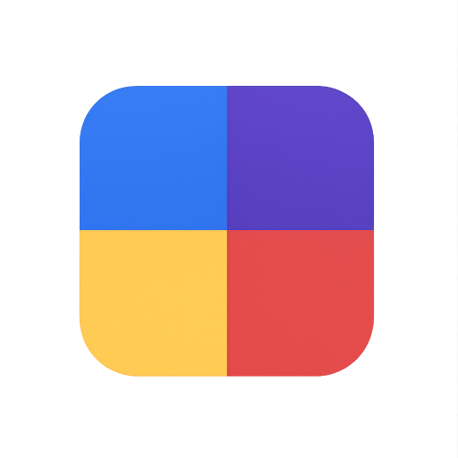

<p align="center">
  
</p>

<h1 align="center">Colors4dev</h1>

<p align="center">
  <strong>Generate accessible color scales for your design system in seconds.</strong>
</p>

<p align="center">
  <a href="https://github.com/hxst1/Colors4dev/stargazers">
    
  </a>
  <a href="https://github.com/hxst1/Colors4dev/blob/main/LICENSE">
    
  </a>
  <a href="https://github.com/hxst1/Colors4dev/issues">
    
  </a>
</p>

<p align="center">
  <a href="#features">Features</a> •
  <a href="#demo">Demo</a> •
  <a href="#getting-started">Getting Started</a> •
  <a href="#usage">Usage</a> •
  <a href="#accessibility">Accessibility</a> •
  <a href="#tech-stack">Tech Stack</a> •
  <a href="#contributing">Contributing</a>
</p>

---

## ✨ Features

- 🎨 **Instant Color Scales** — Generate a full 10-step scale (50-900) from any base color
- 📋 **Multiple Export Formats** — CSS Variables, Tailwind Config, and SCSS with one click
- 🎯 **WCAG Contrast Checker** — Real-time AA/AAA compliance verification
- 👁️ **Color Blindness Simulator** — Preview your palette as users with color vision deficiency see it
- 🌗 **Dark/Light Mode** — Full theme support with consistent contrast ratios
- 📱 **Responsive Design** — Works perfectly on desktop, tablet, and mobile
- ⌨️ **Keyboard Accessible** — Full keyboard navigation and screen reader support
- 🔄 **Multiple Input Formats** — Accepts HEX, RGB, HSL, and OKLCH color values

## 🚀 Demo

Try it live: **[colors4dev.vercel.app](https://colors4dev.vercel.app)** *(update with your actual URL)*

<p align="center">
  
</p>

## 🏁 Getting Started

### Prerequisites

- Node.js 18+ 
- npm, yarn, or pnpm

### Installation

```bash
# Clone the repository
git clone https://github.com/hxst1/Colors4dev.git

# Navigate to the project
cd Colors4dev

# Install dependencies
npm install

# Start the development server
npm run dev
```

Open [http://localhost:3000](http://localhost:3000) in your browser.

### Build for Production

```bash
npm run build
npm start
```

## 📖 Usage

### 1. Choose Your Base Color

Enter a color in any supported format:
- **HEX**: `#826EE7`
- **RGB**: `rgb(130, 110, 231)`
- **HSL**: `hsl(249, 71%, 67%)`
- **OKLCH**: `oklch(0.598, 0.156, 283.5)`

Or use the color picker for visual selection.

### 2. Name Your Token

Give your color scale a semantic name like `brand`, `primary`, `accent`, etc. This name will be used in the exported code.

### 3. Preview & Verify

- **Preview Panel**: See your color in real UI components (buttons, cards, badges)
- **Accessibility Panel**: Check WCAG contrast ratios against white, black, and your brand color
- **Color Blindness Simulator**: Test how your palette appears to users with different types of color vision

### 4. Export Your Code

Click on "Copy-ready snippets" to access:

#### CSS Variables
```css
:root {
  --brand: #826EE7;
  --brand-50: #f5f3ff;
  --brand-100: #ede9fe;
  /* ... */
  --brand-900: #1e1b4b;
}
```

#### Tailwind Config
```typescript
export default {
  theme: {
    extend: {
      colors: {
        brand: {
          50: 'rgb(245, 243, 255)',
          // ...
        }
      }
    }
  }
}
```

#### SCSS
```scss
$brand-50: #f5f3ff;
$brand-100: #ede9fe;
// ...

$brand-palette: (
  50: $brand-50,
  // ...
);
```

## ♿ Accessibility

Colors4dev is built with accessibility as a core principle:

### WCAG Compliance

- All text meets **WCAG 2.1 AA** contrast requirements (4.5:1 for normal text, 3:1 for large text)
- Interactive elements have visible focus states
- Color is never the only means of conveying information

### Keyboard Navigation

| Key | Action |
|-----|--------|
| `Tab` | Navigate between interactive elements |
| `Enter` / `Space` | Activate buttons and controls |
| `Arrow Keys` | Navigate within radio groups |

### Screen Reader Support

- Semantic HTML structure with proper heading hierarchy
- ARIA labels on all interactive elements
- Live regions for dynamic content updates
- Descriptive alt text and accessible names

### Color Blindness Consideration

The built-in simulator helps you verify your palette works for users with:
- **Protanopia** (red-blind)
- **Deuteranopia** (green-blind)
- **Tritanopia** (blue-blind)
- **Achromatopsia** (total color blindness)

## 🛠️ Tech Stack

- **Framework**: [Next.js 15](https://nextjs.org/) with App Router
- **Styling**: [Tailwind CSS 4](https://tailwindcss.com/)
- **Language**: [TypeScript](https://www.typescriptlang.org/)
- **Fonts**: [Geist](https://vercel.com/font) by Vercel
- **Color Science**: Custom algorithms for perceptually uniform scales

## 📁 Project Structure

```
Colors4dev/
├── app/
│   ├── globals.css      # Design tokens & utility classes
│   ├── layout.tsx       # Root layout with metadata
│   └── page.tsx         # Main application page
├── components/
│   ├── AccessibilityPanel.tsx  # WCAG contrast checker
│   ├── ColorBlindness.tsx      # Color blindness simulator
│   ├── Controls.tsx            # Color input controls
│   ├── Preview.tsx             # UI component previews
│   ├── SnippetsAccordion.tsx   # Code export panel
│   └── Swatch.tsx              # Color swatch component
├── lib/
│   └── color.ts         # Color manipulation utilities
└── public/
    └── ...              # Icons and manifest
```

## 🤝 Contributing

Contributions are welcome! Here's how you can help:

1. **Fork** the repository
2. **Create** a feature branch (`git checkout -b feature/amazing-feature`)
3. **Commit** your changes (`git commit -m 'Add amazing feature'`)
4. **Push** to the branch (`git push origin feature/amazing-feature`)
5. **Open** a Pull Request

### Ideas for Contributions

- [ ] Add more export formats (CSS-in-JS, Swift, Kotlin)
- [ ] Implement color harmony suggestions
- [ ] Add gradient generator
- [ ] Create browser extension
- [ ] Add palette history/favorites

## 📄 License

This project is licensed under the MIT License - see the [LICENSE](LICENSE) file for details.

## 💖 Support

If you find this tool useful, please consider:

- ⭐ **Starring** the repository
- 🐛 **Reporting** bugs or issues
- 💡 **Suggesting** new features
- 📢 **Sharing** with other developers

---

<p align="center">
  Made with ❤️ by <a href="https://github.com/hxst1">hxst1</a>
</p>